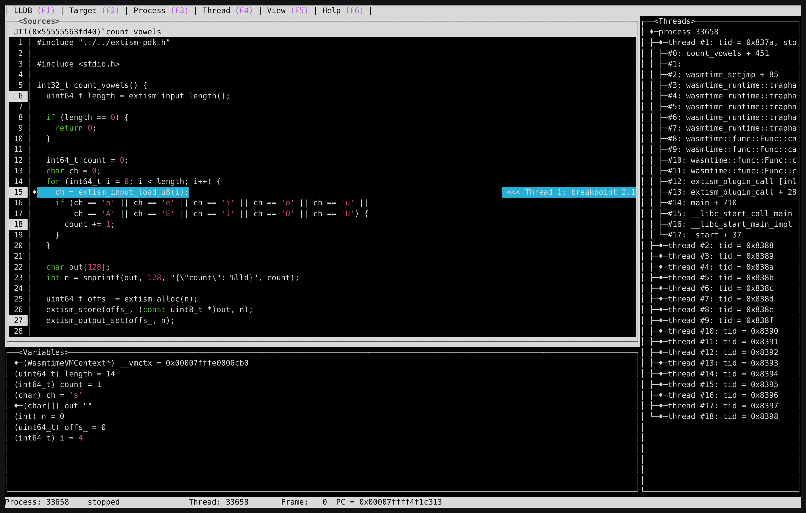

# extism-dbg

Debugging for [Extism](https://github.com/extism/extism) plugins



## Installation

```bash
$ make build && sudo make install
```

This will install `extism-dbg` and `extism-lldb`:
- `extism-dbg` is a minimal Extism host used to wrap the plugin.
- `extism-lldb` is a shim to use LLDB to debug Extism plugins called from `extism-dbg` 

## Usage

The following command will start LLDB with a breakpoint set on the specified plugin function, 
just type `run` at the LLDB prompt to start executing the plugin:

```bash
$ extism-lldb code.wasm count_vowels @input.txt
```
Arguments:
1. WebAssembly module or Manifest file
2. Function to call
3. Input
 
If the `input` argument starts with `@` then the input will be loaded from a file otherwise it will 
be passed as-is. An `LLDB_FLAGS` environment variable can be used to pass additional flags to LLDB.
